# Screenshots Evidence Pack

## Day 1 - Repo bootstrap
### Repo structure 
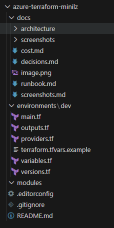

### Tooling versions 

## Day 2 - Resource Group

### Terraform apply 

### Resource group in portal 

## Day 3 - Network

### Terraform apply in francecentral (because of policy)

### Virtual network 

### Mgmt/app subnets 

## Day 4 - NSG baseline

### Mgmt NSG with SSH rule 

### Subnet NSG associations 

### Troubleshooting -- disallowed region
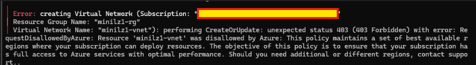
I used eastaisa at first and no trouble in the before date. However, when deploying vnet, exist error: RequestDisallowedByAzure.
After reading the error message, I find that eastasia is not the available region for "azure for student". So, I find the policy in Azure Portal and only a few region is available for me. I decided to change the location to "franchcentral". Because of parameterization of the region attribute, I just need to change a variable in .tfvars and fixed easily.

## Day 5 - Cost guardrails

### RG budget
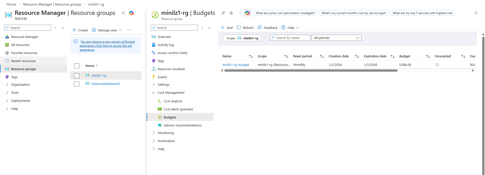

### Budget details 
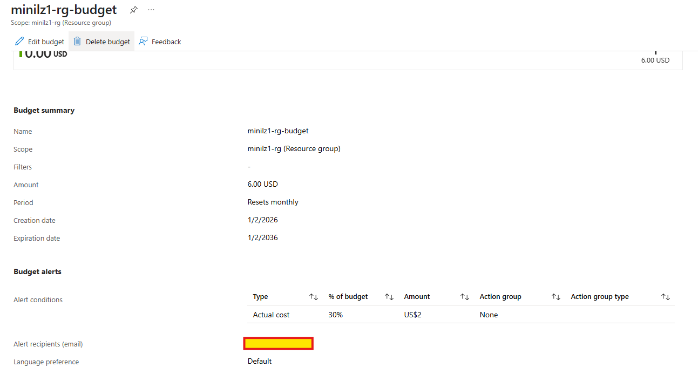

## Day 6 - Hub and Spoke networking

### Hub and spoke VNets 
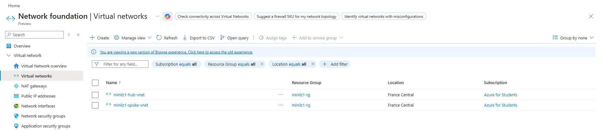

## Day 7 - Logging and monitoring

### Log Analytics workspace 
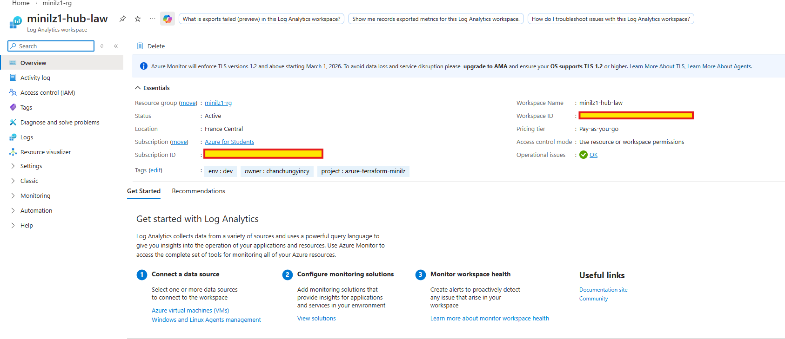

### Action Group
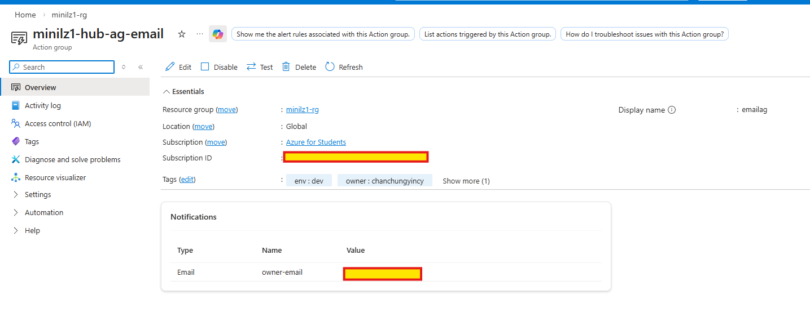

## Day 8 - Linux VM

### Terraform apply 
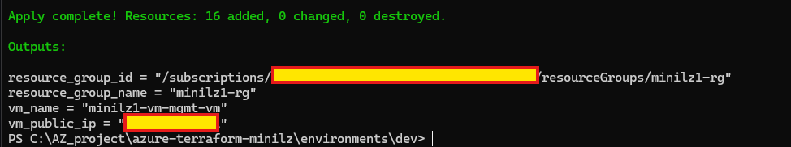

### VM networking 
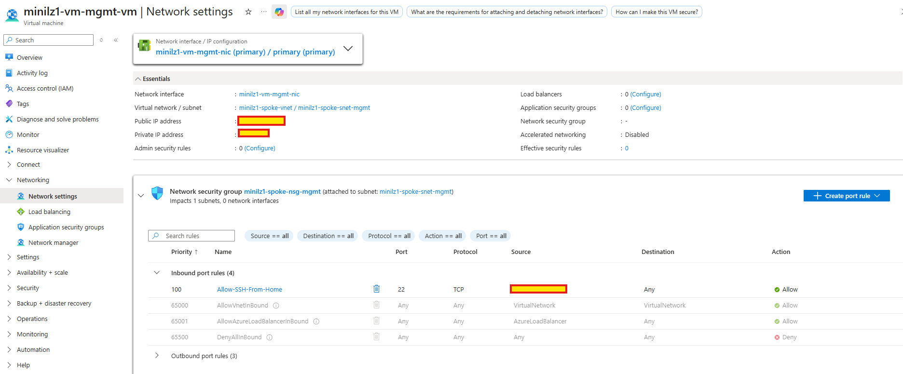

### SSH into VM 
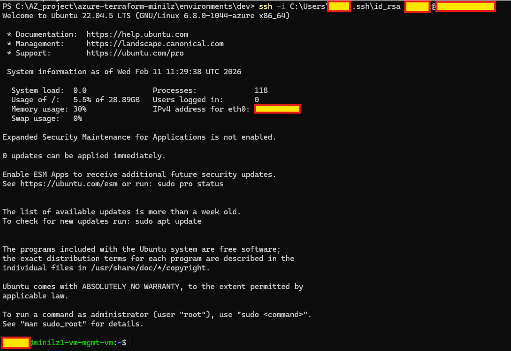

## Day 9 - Tagging and policy

### Tagged resources 
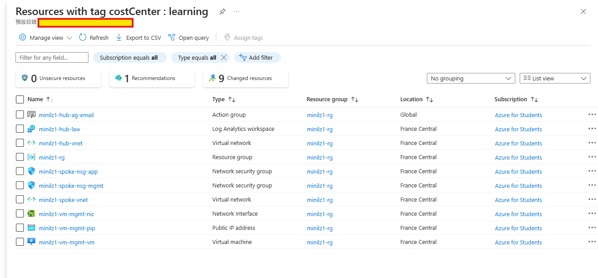

### Tag policy assignment 
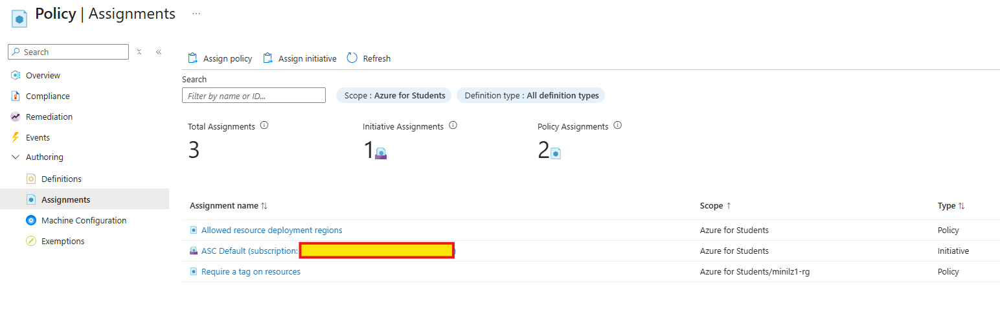

## Day 10 - CI/CD identity and RBAC

### App registration for GitHub Actions 
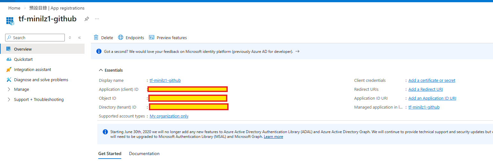

### RG role assignment 
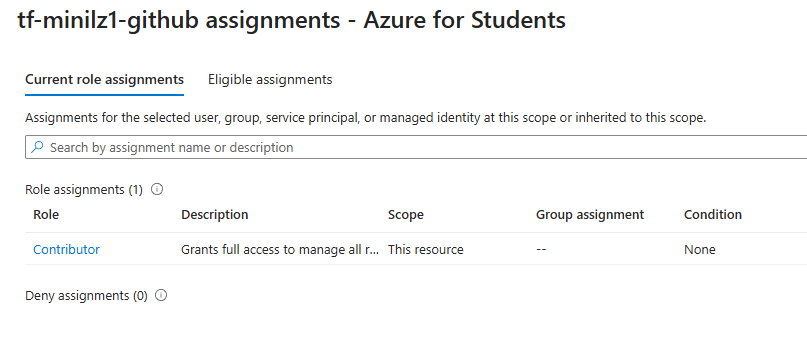

## Day 11 - Remote state backend

### Storage account container with tfstate (proves: remote backend configured)
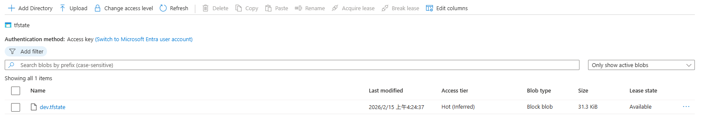