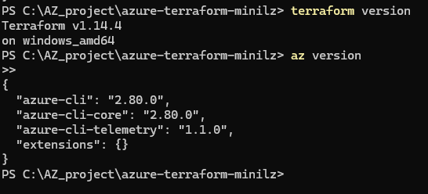
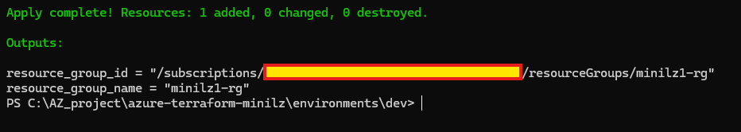
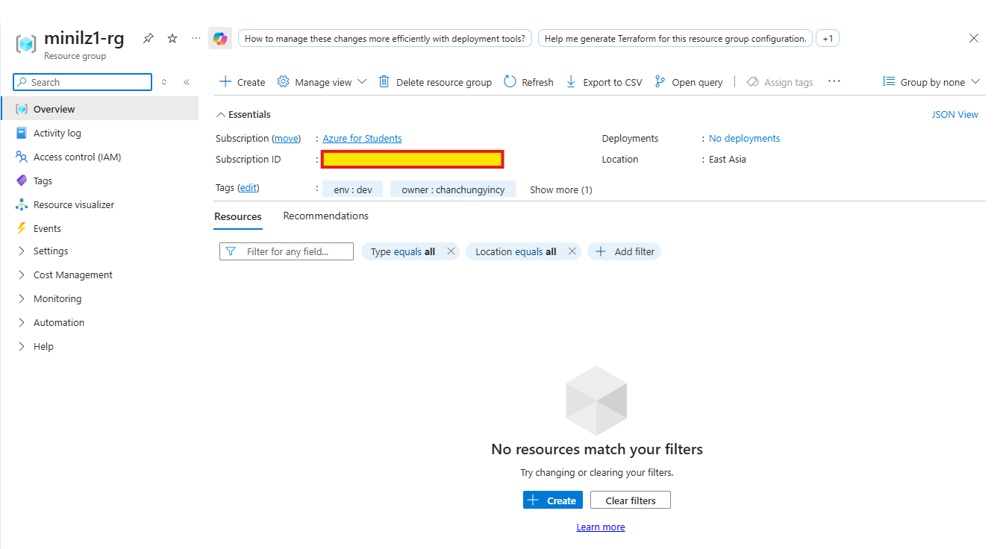
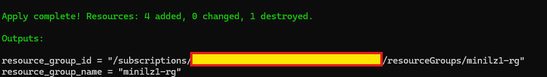
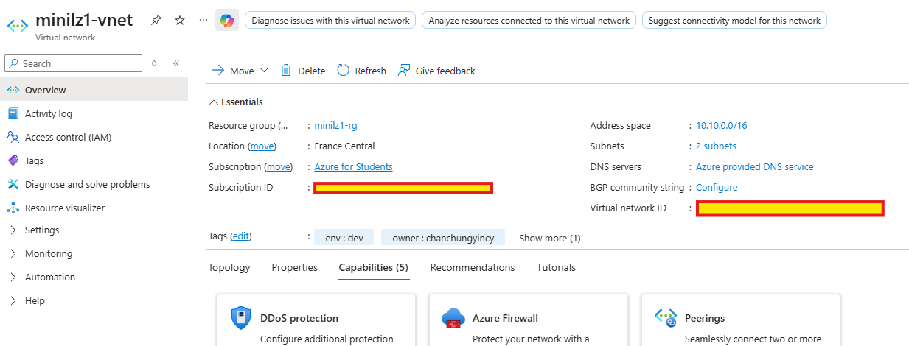
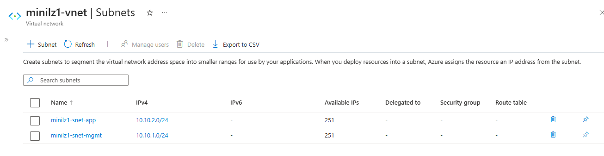
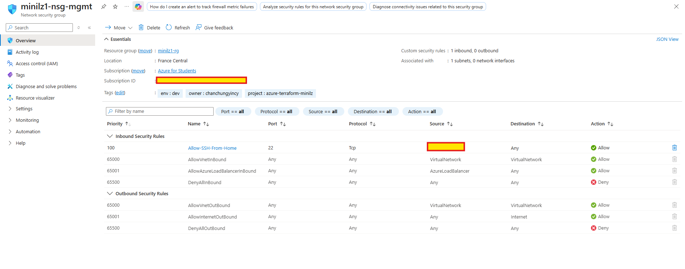
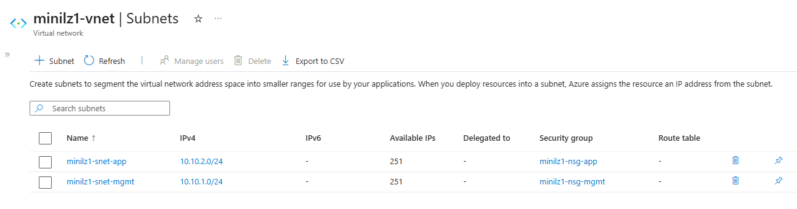

# Screenshots Evidence Pack

## Day 1 - Repo bootstrap
### Repo structure 

### Tooling versions 

## Day 2 - Resource Group

### Terraform apply 

### Resource group in portal 

## Day 3 - Network

### Terraform apply in francecentral (because of policy)

### Virtual network 

### Mgmt/app subnets 

## Day 4 - NSG baseline

### Mgmt NSG with SSH rule 

### Subnet NSG associations 

